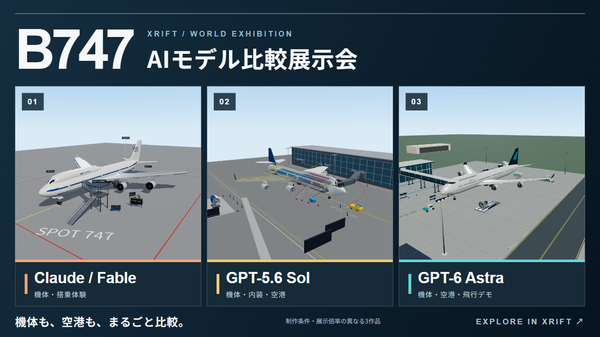

# B747 AIモデル比較展示会

Claude / Fable、GPT-5.6 Sol、GPT-6 Astraで制作したB747作品を、機体・内装・空港設備ごと見比べるXRiftワールド。



## 見学

入口はSol展示の前。案内板から各作品、機体の近く、客室、上階、操縦席、俯瞰デッキへ移動できます。機内とデッキには見学通路へ戻るボタンがあります。

- **横並び比較**：3作品の機首を+Zへそろえて、300m間隔で展示。Claudeは元の原点、SolはX=300m、AstraはX=600m。
- **Sol / Astra 原作全景**：他作品を隠し、原作の遠景・滑走路・格納庫を含めて表示。遠景の大きな地面が隣の作品を覆わないための切替です。
- **Astra 飛行デモ**：元ファイルの別シーンを専用の空中デッキから鑑賞。再生・停止と帰還ボタン付き。
- **動きを再生 / 停止**：Blenderから移したエンジン分解アニメーションを再生。Claudeの従来の分解・解説操作も残しています。

## 比較条件

これは制作条件の異なる作品を鑑賞する展示です。モデル名はユーザー指定と素材フォルダ名に基づき、厳密な同一プロンプト・同一時間のモデル性能評価ではありません。

| 作品 | 取り込み | 縮尺・補正 |
|---|---|---|
| Claude / Fable | 既存のReact製ワールド、搭乗ゲート、分解展示、解説 | 機体・ゲートは従来どおり1.25倍、家具と独立展示は等身大 |
| GPT-5.6 Sol | Blenderの空港シーン全体 | 1単位=1m。元GLBの白化を、Blenderに記録済みのRGBA値から補正 |
| GPT-6 Astra | Blenderのミュージアム、遠景、別シーンの飛行デモ | 1単位=1m。複雑なガラス材質をglTF互換材質へ近似 |

Blender原本は変更していません。頂点の間引きは行わず、アニメーションの親ごとに静的メッシュを結合して描画回数を抑えています。照明・空はXRift共通環境を使用します。Blender固有の操作パネル、シェーダーによる断面切替、初期状態で非表示の構造は操作機能として移植していません。

詳細：[Sol取り込み記録](docs/sol-import-notes.md) / [Astra取り込み記録](docs/astra-import.md) / [既存Claude作品の説明](docs/claude-original.md)

## ローカル開発

```powershell
npm install
# この環境ではNodeのcompile cache有効化が停止したため、必要な場合に指定
$env:NODE_DISABLE_COMPILE_CACHE = '1'
npm run dev -- --host 127.0.0.1 --port 5184
npm run typecheck
npm run build
node scripts/verify-exhibition-floors.mjs
```

`src/dev.tsx`は開発専用。`?cam=x,y,z&look=x,y,z`で撮影位置を固定できます。`?exhibit=sol`、`astra`、`flight`で各表示を直接確認できます。表示文字を変更した場合は公式Noto Sans JPフォントを用意して`python subset-font.py`を再実行します。同梱フォントのライセンスは`public/NotoSansJP-OFL.txt`です。

## 検証と制約

- 原本の前後SHA256、GLBの形状範囲・三角形数・アニメーションを確認。詳細は各取り込み記録を参照。
- 6か所の機内移動先と2か所の接続路について、各中心と前後左右25cm、計40点で実collision GLBへの床raycastが合格。
- 表示床と衝突形状を同じ回転・平行移動で配置。接続通路・俯瞰デッキ・飛行デッキも表示形状に合う床を配置。
- 衝突対象は床と階段が中心。座席・外板・車両・壁のすべてを歩行障害物にはしていません。
- Solの一部エンジン部品の地面下配置、上階床の階段開口不足は原作どおり。階間移動はテレポートを併用します。
- Astra貨物室は天井が低いため、立位テレポートは追加していません。
- 主展示GLBだけで約128MB、飛行シーン約21MB。ブラウザでの表示確認と、Quest等の実機での性能・歩行の受け入れ確認は別です。
- 表示モードとBlender由来の再生状態は各見学者ローカル。既存Claudeの部品選択・分解状態は従来どおりインスタンス共有です。

GitHubへの保存とXRiftへの公開は別工程です。公開時は既存`.xrift/world.json`を使用して公開状態を確認してください。

## Windowsからの公開

公開モデルは`public/sol-*.glb`、`public/astra-*.glb`として直下に配置します。XRift CLI/SDKがWindowsの相対パス区切りをそのまま配信名に使うため、サブフォルダのまま公開するとURLが一致せず404になります。
